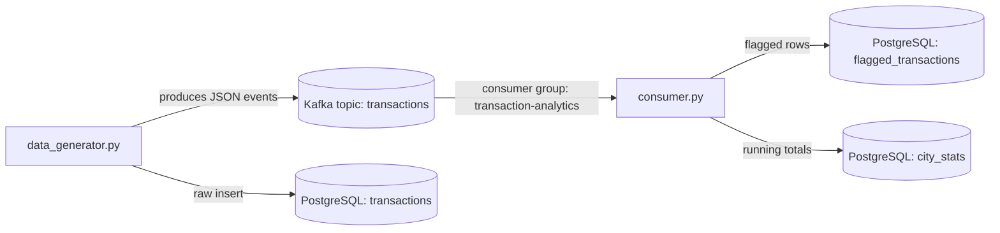
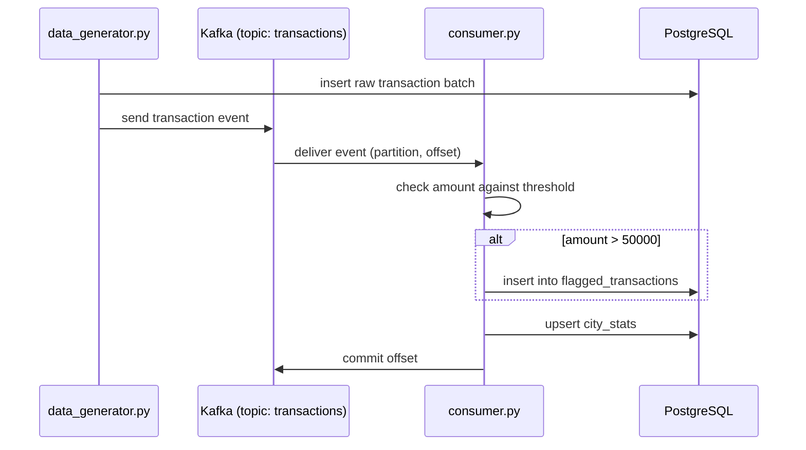

## Topics & Partitions

A small end-to-end Kafka project that simulates a stream of bank transactions, writes them to Kafka, and processes them with a downstream consumer that flags high-value transactions and maintains per-city statistics in PostgreSQL.

It's built as a hands-on companion for learning core Kafka concepts: topics, partitions, consumer groups, and offset commits, backed by a real producer/consumer pair instead of just theory.

### Architecture



### Data flow



### Project structure

```
.
├── data_generator.py    producer: generates and streams transactions
├── consumer.py          consumer: aggregates and flags transactions
├── main.py              entry point for running either component
├── docker-compose.yml   Kafka, Zookeeper, and PostgreSQL
├── pyproject.toml
└── requirements.txt
```

### Prerequisites

- Python 3.12+
- Docker and Docker Compose

### Setup

Start the infrastructure:

```
docker compose up -d
```

This brings up:

| Service    | Host port |
|------------|-----------|
| Kafka      | 9093      |
| Zookeeper  | 2181      |
| PostgreSQL | 5433      |

Install dependencies:

```
pip install -r requirements.txt
```

### Running

Start the producer in one terminal:

```
python main.py producer
```

Start the consumer in another terminal:

```
python main.py consumer
```

The producer streams 20 transactions per second into the `transactions` topic and mirrors them into the `transactions` table in PostgreSQL. The consumer reads from that topic in the `transaction-analytics` consumer group, flags any transaction above ₹50,000 into `flagged_transactions`, and keeps running totals per city in `city_stats`.

### Inspecting the data

```
psql -h localhost -p 5433 -U postgres -d kafka_practice -c "select * from flagged_transactions limit 10;"
psql -h localhost -p 5433 -U postgres -d kafka_practice -c "select * from city_stats order by total_amount desc;"
```

To watch the raw Kafka messages directly:

```
docker exec -it $(docker ps -qf name=kafka) kafka-console-consumer \
  --bootstrap-server localhost:9092 --topic transactions --from-beginning
```

### Notes

The topic currently relies on Kafka's default partition count and `KAFKA_AUTO_CREATE_TOPICS_ENABLE`. To experiment with partitioning behavior, create the topic explicitly with multiple partitions before starting the producer:

```
docker exec -it $(docker ps -qf name=kafka) kafka-topics \
  --create --topic transactions --partitions 3 --replication-factor 1 \
  --bootstrap-server localhost:9092
```

Running multiple instances of `consumer.py` with the same group ID will split those partitions across the instances automatically, which is a good way to observe consumer group rebalancing in practice.
